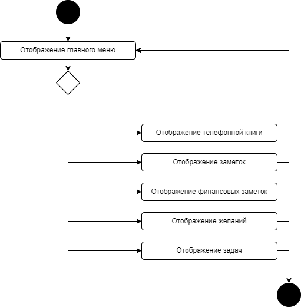

# Содержание
1. [Выбор окна из главного меню](#1)  
2. [Телефонная книга](#2)  
2.1. [Добавить номер телефона и ФИО человека в таблицу](#2.1)  
2.2. [Найти в таблице по ФИО](#2.2)  
2.3. [Найти в таблице по номеру телефона](#2.3)  
2.4. [Записать данные в базу данных](#2.4)  
2.5. [Прочитать данные из базы данных](#2.5)  
3. [Записки](#3)   
3.1.    
4. [Финансовые записи](#4)  
5. [Задачи](#5)  
6. [Желания](#6)  

## 1. Выбор окна из главного меню
При открытии приложения пользователю необходимо выбрать окно с которым он будет работать, либо вовсе выйти из приложения

## 2. Телефонная книга 

### 2.1 Добавить номер телефона и ФИО человека 

### 2.2 Найти в таблице по ФИО 

### 2.3 Найти в таблице по номеру телефона 

### 2.4 Записать данные в базу данных 

### 2.5 Прочитать данные из базы данных 