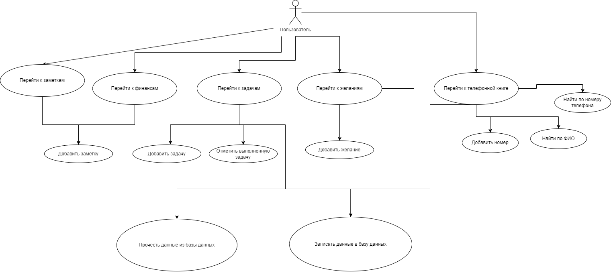
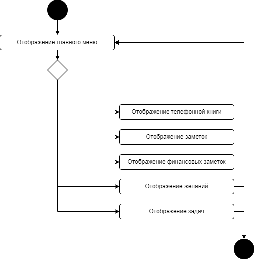

# Поток событий

# Содержание
1. [Выбор окна из главного меню](#1)  
2. [Телефонная книга](#2)  
2.1. [Добавить номер телефона и ФИО человека в таблицу](#2.1)  
2.2. [Найти в таблице по ФИО](#2.2)  
2.3. [Найти в таблице по номеру телефона](#2.3)  
2.4. [Записать данные в базу данных](#2.4)  
2.5. [Прочитать данные из базы данных](#2.5)  
3. [Записки](#3)   
3.1. [Добавить заметку за определённую дату](#3.1)   
<!--3.2. [Записать данные в базу данных](#3.2)  -->
<!--3.3. [Прочитать данные из базы данных](#3.3)   -->
4. [Финансовые записи](#4)  
4.1. [Добавить заметку за определённую дату](#4.1)   
4.2. [Добавить прибыль за определённую дату](#4.2)   
4.3. [Добавить траты за определённую дату](#4.3)  
4.4. [Вывести график трат и прибыли за месяц](#4.4)  
<!--4.5. [Записать данные в базу данных](#4.5)  -->
<!--4.6. [Прочитать данные из базы данных](#4.6)  -->
5. [Задачи](#5)  
5.1. [Добавить задачу](#5.1)  
5.2. [Пометить задачу как выполненную](#5.2)  
5.3. [Записать данные в базу данных](#5.3)  
5.4. [Прочитать данные из базы данных](#5.4)  
5.5. [Найти задачу](#5.5)  
5.6. [Найти выполненную задачу](#5.6)  
6. [Желания](#6)  
6.1. [Добавить желания: название желания и путь его достижения за определённую дату](#6.1)  
6.2. [Найти желание](#6.2)  
6.3. [Найти путь достижения](#6.3)  
<!--6.4. [Записать данные в базу данных](#6.4)  -->
<!--6.5. [Прочитать данные из базы данных](#6.5)  -->

## 1. Выбор окна из главного меню
При открытии приложения пользователю необходимо выбрать окно с которым он будет работать, либо вовсе выйти из приложения

## 2. Телефонная книга 

### 2.1 Добавить номер телефона и ФИО человека 
**Описание.** Добавление номера телефона и фио человека в таблицу.

**Основной поток.**
1. Переход на окно телефонной книги.
2. В данном окне имеются два поля: ФИО и номер телефона.
3. Необходимо заполнить два данных поля.
4. Следует кликнуть кнопку "Добавить".
5. Данное ФИО и номер телефона выводится в таблице.

### 2.2 Найти в таблице по ФИО 
**Описание.** Поиск в таблице по полю ФИО.

**Основной поток.**
1. Необходимо заполнить специальное поле для поиска ФИО.
2. Кликнуть кнопку "Найти по ФИО".
3. Увидеть в таблице поиска ФИО и номер человека.

### 2.3 Найти в таблице по номеру телефона 
**Описание.** Поиск в таблице по полю номера телефона.

**Основной поток.**
1. Необходимо заполнить специальное поле для поиска номера телефона.
2. Кликнуть кнопку "Найти по номеру телефона".
3. Увидеть в таблице поиска ФИО и номер человека.

### 2.4 Записать данные в базу данных 

### 2.5 Прочитать данные из базы данных 

## 3. Записки 

### 3.1 Добавить заметку за определённую дату 

## 4. Финансовые записи 

### 4.1 Добавить заметку за определённую дату 

### 4.2 Добавить прибыль за определённую дату 

### 4.3. Добавить траты за определённую дату 

### 4.4. Вывести график трат и прибыли за месяц 

## 5. Задачи 

### 5.1 Добавить задачу 

### 5.2 Пометить задачу как выполненную 

### 5.3 Записать данные в базу данных 

### 5.4 Прочитать данные из базы данных 

### 5.5 Найти задачу 

### 5.6 Найти выполненную задачу 

## 6. Желания 

### 6.1. Добавить желания: название желания и путь его достижения за определённую дату 

### 6.2. Найти желание 

### 6.3. Найти путь достижения 